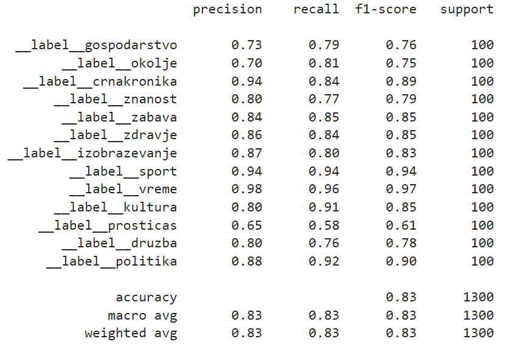
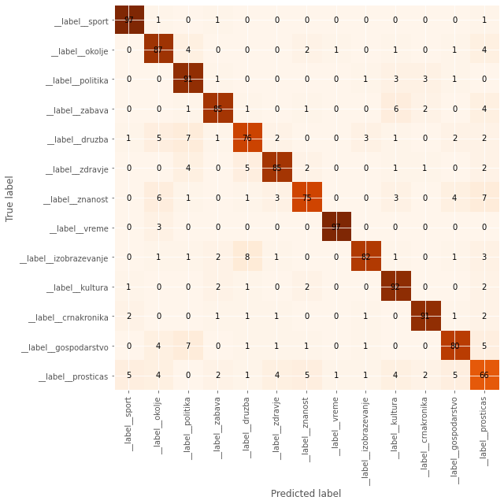

# FastText-Classification-on-SLED
 
Training a fastText model on the SLED categorization dataset.

## Main conclusions

The fastText model, trained on Slovene embeddings achieved slightly (2 points) better results than the model that was not trained on the embeddings. The highest micro and macro F1 scores that were achieved on this task are 0.85.

| Embeddings | Micro F1 | Macro F1 |
|:---------:|---------:|----------|
|    yes      |  0.85     |  0.85   |
|    no      |    0.83      |    0.83      |


The hyperparameter search, focused on the number of epochs, revealed optimum numbers to be quite high - 800 epochs for the model without the embeddings, and 400 epochs for the model with the embeddings. Other hyperparameters were set to default values.


## FastText model without the embeddings

### Hyperparameter search

During the hyperparameter search, I only experimented with different numbers of epochs. I did not use the automatic hyperparameter search, but did the experiments "manually", by training the models on the train split, with different numbers of epochs each time, and evaluating them on the dev split.


As we can see from the plot, the micro and macro F1 scores keep rising until the epoch 800, afterwards, the scores remain around 0.83. For testing, I used 800 epochs, other hyperparameters were left on default values.

| Tested on | Micro F1 | Macro F1 |
|:---------:|---------:|----------|
|    dev    |   0.8346       |   0.8348       |
|    test      |    0.8285      |    0.8282      |

Classification report:



Confusion matrix for test file:


The model is saved to the Wandb - to load it:
```
!pip install wandb
import wandb
wandb.login()

# Initialize Wandb
run = wandb.init(project="SLED-categorization", entity="tajak", name="testing-trained-model")

# Load the saved model
artifact = run.use_artifact('tajak/SLED-categorization/SLED-categorization-trainsmall-noembeddings-model:v0', type='model')
artifact_dir = artifact.download()

model = fasttext.load_model(f"{artifact_dir}/FastText-model-trainsmall-noembeddings.bin")
```


## FastText model with the embeddings

I used Slovene embeddings from the CLARIN.SI repository: Word embeddings CLARIN.SI-embed.sl 1.0 (https://www.clarin.si/repository/xmlui/handle/11356/1204).

The hyperparameter search was conducted in the same manner as in the previous experiment.


As we can see from the plot, the micro and macro F1 scores keep rising until the epoch 400, afterwards, the scores remain around 0.85 which is not much higher than the results of the model without the embeddings, evaluated on dev. For testing, I used 400 epochs, other hyperparameters were left on default values.


| Tested on | Micro F1 | Macro F1 |
|:---------:|---------:|----------|
|    dev    |   0.8461       |   0.8457       |
|    test      |  0.8492     |  0.8487  |

Classification report:


Confusion matrix for the test file:



The model is saved to the Wandb - to load it:
```
!pip install wandb
import wandb
wandb.login()

# Initialize Wandb
run = wandb.init(project="SLED-categorization", entity="tajak", name="testing-trained-model")

# Load the saved model
artifact = run.use_artifact('tajak/SLED-categorization/SLED-categorization-trainsmall-embeddings-model:v0', type='model')
artifact_dir = artifact.download()

model = fasttext.load_model(f"{artifact_dir}/FastText-model-trainsmall-embeddings.bin")
```