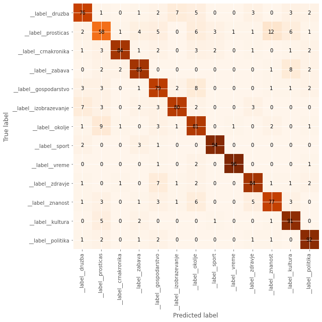
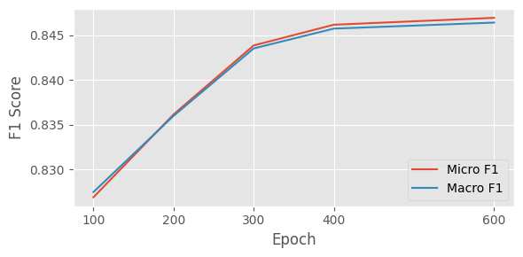
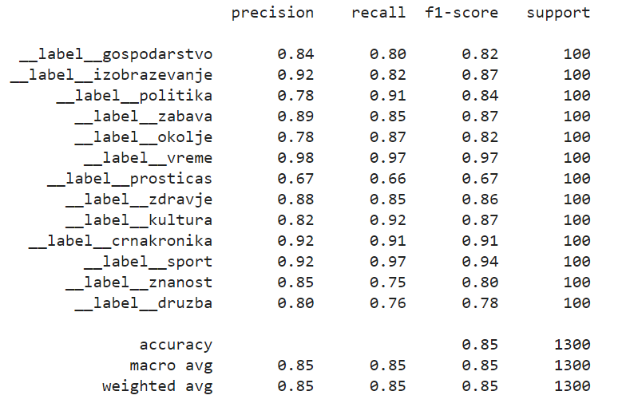
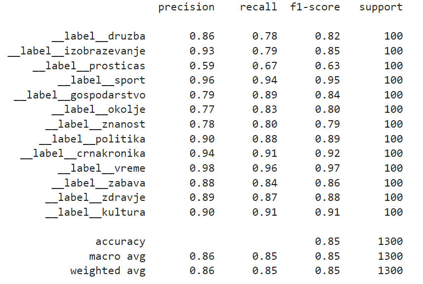
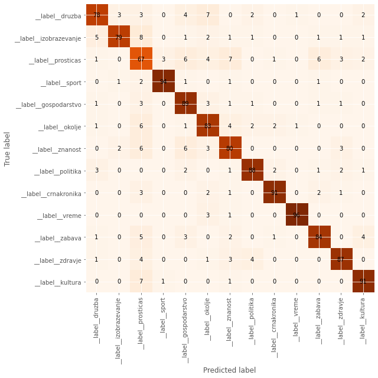
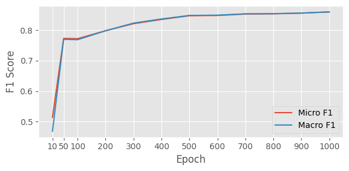

# Topic classification on SLED

Content:
- [Data](#data)
- [Training Transformer models](#training-transformer-models)
- [Training fastText models](#training-fasttext-models)

## Data

For training FastText models, I experimented with both trainsmall and trainlarge (36,032 instances), while for Transformer models, I used the trainsmall train split. The dataset (with the trainsmall) has 12,603 instances, annotated with 13 labels: ['crnakronika', 'druzba', 'gospodarstvo', 'izobrazevanje', 'kultura', 'okolje', 'politika', 'prosticas', 'sport', 'vreme', 'zabava', 'zdravje', 'znanost']. The dataset is more or less balanced.

Analysis revealed that there are 18 duplicated texts (some even in different splits) -> they were discarded. The final dataset that I used consists of 12,585 instances.

|               |   label |
|:--------------|--------:|
| crnakronika   |    1000 |
| druzba        |    1000 |
| gospodarstvo  |    1000 |
| politika      |    1000 |
| sport         |    1000 |
| zabava        |    1000 |
| zdravje       |     999 |
| kultura       |     998 |
| znanost       |     951 |
| vreme         |     926 |
| prosticas     |     912 |
| okolje        |     904 |
| izobrazevanje |     895 |

|  split     |   number of texts |
|:------|--------:|
| trainsmall |    9990 |
| test  |    1299 |
| dev   |    1296 |

Most of the texts are short - using 512 as max_seq_length will capture most of the texts to their entirety:

|       |    length |
|:------|----------:|
| mean  |   242.994 |
| std   |   109.83  |
| min   |    97     |
| 25%   |   143     |
| 50%   |   217     |
| 75%   |   313     |
| max   |  1382     |

## Training Transformer models

I used XLM-RoBERTa (base-sized) and SloBERTa model. I performed a hyperparameter search to find the optimum number of epochs. The optimum number of epochs for XLM-RoBERTa was revealed to be 6, and for SloBERTa 8. Other hyperparameter values are the same for both models:

```
args= {
    "overwrite_output_dir": True,
    "num_train_epochs": epoch,
    "train_batch_size":8,
    "learning_rate": 1e-5,
    "labels_list": LABELS,
    # Change no_save and no_cache to False if you want to save the model:
    "no_cache": True,
    "no_save": True,
    "max_seq_length": 512,
    "save_steps": -1,
    "save_model_every_epoch":False,
    "wandb_project": 'SLED-categorization',
    "silent": True,
    }
```

### Hyperparameter search

First, I trained the models and performed evaluation during training to observe the train and evaluation loss (using the Wandb platform). Then I experimented with the epochs at which the evaluation loss did not start significantly rising yet (epochs 2, 4, 6, 8 for XLM-RoBERTa, and epochs 2, 4, 6, 8, 10 for SloBERTa).


Results of the hyperparameter search on dev:

XLM-RoBERTa:
- epoch 2: Macro f1: 0.912, Micro f1: 0.913
- epoch 4: Macro f1: 0.913, Micro f1: 0.914
- epoch 6: Macro f1: 0.915, Micro f1: 0.916
- epoch 8: Macro f1: 0.911, Micro f1: 0.912

SloBERTa:
- epoch 2: Macro f1: 0.917, Micro f1: 0.917
- epoch 4: Macro f1: 0.917, Micro f1: 0.917
- epoch 6: Macro f1: 0.923, Micro f1: 0.924
- epoch 8: Macro f1: 0.926, Micro f1: 0.927
- epoch 10: Macro f1: 0.923, Micro f1: 0.924

The optimum number of epochs was revealed to be 6 for XLM-RoBERTa and 8 for SloBERTa.


## Training fastText models

The fastText model, trained on Slovene embeddings achieved slightly (2 points) better results than the model that was not trained on the embeddings. The highest micro and macro F1 scores that were achieved on this task are 0.85. Training on the trainlarge gives only slightly better results (2 points) for the model that was not trained with embeddings, while it takes much more time than with trainsmall (53 minutes versus 14 minutes for 800 epochs). For the model, trained on the embeddings, there is no difference between the trainsmall and trainlarge.

| Embeddings, train file | Micro F1 | Macro F1 |
|:---------:|---------:|----------|
|    yes, trainsmall      |  0.85     |  0.85   |
|    yes, trainlarge      |  0.85       |   0.85      |
|    no, trainlarge      |   0.85       |   0.85      |
|    no, trainsmall      |    0.83      |    0.83      |


The hyperparameter search, focused on the number of epochs, revealed optimum numbers to be quite high - 800 epochs for the model without the embeddings, and 400 epochs for the model with the embeddings. Other hyperparameters were set to default values. When training on the trainlarge, the optimal number of epochs was even bigger: 900 for the model without the embeddings, 1000 for the model with embeddings.

For more details, see [Details on FastText classification](#details-on-fasttext-classification).

## Details on FastText classification

Content:
- [FastText model without the embeddings (trainsmall)](#fasttext-model-without-the-embeddings-trainsmall)
- [FastText model with the embeddings (trainsmall)](#fasttext-model-with-the-embeddings-trainsmall)
- [FastText model without the embeddings (trainlarge)](#fasttext-model-without-the-embeddings-trainlarge)
- [FastText model with embeddings (trainlarge)](#fasttext-model-with-embeddings-trainlarge)

### FastText model without the embeddings (trainsmall)

During the hyperparameter search, I only experimented with different numbers of epochs. I did not use the automatic hyperparameter search, but did the experiments "manually", by training the models on the train split, with different numbers of epochs each time, and evaluating them on the dev split.


As we can see from the plot, the micro and macro F1 scores keep rising until the epoch 800, afterwards, the scores remain around 0.83. For testing, I used 800 epochs, other hyperparameters were left on default values.

| Tested on | Micro F1 | Macro F1 |
|:---------:|---------:|----------|
|    dev    |   0.8346       |   0.8348       |
|    test      |    0.8285      |    0.8282      |

Classification report:


Confusion matrix for test file:




### FastText model with the embeddings (trainsmall)

I used Slovene embeddings from the CLARIN.SI repository: Word embeddings CLARIN.SI-embed.sl 1.0 (https://www.clarin.si/repository/xmlui/handle/11356/1204).

The hyperparameter search was conducted in the same manner as in the previous experiment.



As we can see from the plot, the micro and macro F1 scores keep rising until the epoch 400, afterwards, the scores remain around 0.85 which is not much higher than the results of the model without the embeddings, evaluated on dev. For testing, I used 400 epochs, other hyperparameters were left on default values.


| Tested on | Micro F1 | Macro F1 |
|:---------:|---------:|----------|
|    dev    |   0.8461       |   0.8457       |
|    test      |  0.8492     |  0.8487  |

Classification report:



Confusion matrix for the test file:


### FastText model without the embeddings (trainlarge)

Similarly to the model, trained on trainsmall train split, the optimum number of epochs revealed to be quite large - the scores stop rising at 900 epochs -> I used 900 epochs as the optimum value.


| Tested on | Micro F1 | Macro F1 |
|:---------:|---------:|----------|
|    dev    |   0.860       |   0.861       |
|    test      |   0.8515       |   0.8533      |

Classification report:



Confusion matrix:



### FastText model with embeddings (trainlarge)

While the optimal number of epochs for trainsmall with embeddings was 400 epochs, the hyperparameter showed that when training on trainlarge, the optimal number is much higher - even after 1000, the scores kept rising (although slowly). As training on 1000 epochs takes more than 100 minutes, I stoped searching for the optimum epoch number after 1000 epochs and used this number for testing.



| Tested on | Micro F1 | Macro F1 |
|:---------:|---------:|----------|
|    dev    |   0.860       |   0.8603       |
|    test      |   0.8531       |   0.8537      |

Classification report:


Confusion matrix:


